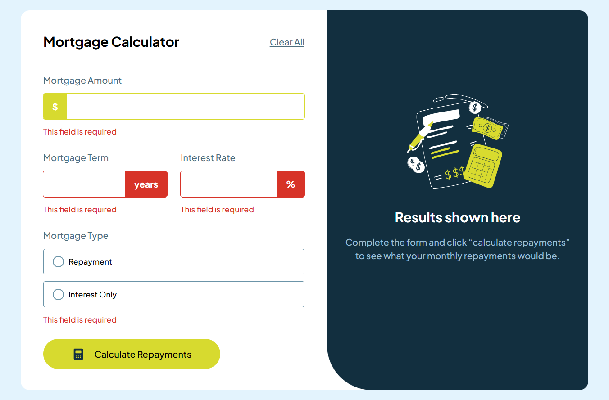

# Mortgage Repayment Calculator

An interactive mortgage repayment calculator app that helps users calculate their monthly repayments and total interest paid.



## Features

Users are able to:

- Input mortgage information and see monthly repayment and total repayment amounts after submitting the form
- See form validation messages if any field is incomplete
- Complete the form only using their keyboard
- View the optimal layout for the interface depending on their device's screen size
- See hover and focus states for all interactive elements on the page

## Technologies used

- REACT
- TAILWIND
- TYPESCRIPT
- CONTEXT API
- VITE

## Getting Started

To run this project locally, follow these steps:

1. Clone the repository:
   ```bash
   git clone https://github.com/Davichobits/mortgage-repayment-calculator.git
   ```  
2. Navigate to the project directory:
   ```bash
   cd mortgage-repayment-calculator
   ```
3. Install the dependencies:
   ```bash
   npm install
   ```
4. Start the development server:
   ```bash
   npm run dev
   ```

## Author

David Ruiz - Frontend Developer
- [Github](https://github.com/Davichobits)
- [Frontend Mentor](https://www.frontendmentor.io/profile/Davichobits) 
- [Linkedin](https://www.linkedin.com/in/davidirc/)
- [YouTube](https://www.youtube.com/CodingTube)
- [codingtube.dev](https://codingtube.dev/)

    <!-- ## Tutorial

    You can follow this tutorial to learn how to build a mortgage repayment calculator app using React, TypeScript, and Context API.

    [](https://www.youtube.com/watch?v=9WtElr5T4Mo) -->

## GitAds Sponsored
[](https://gitads.dev/v1/ad-track?source=davichobits/davichobits@github)